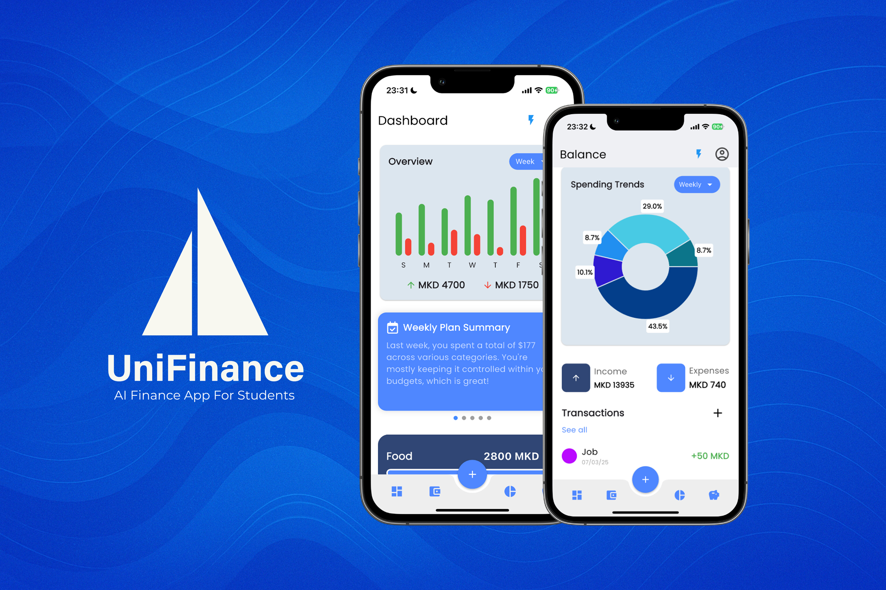

# UniFinance - AI Finance App for Students

A smart finance management app tailored for university students, featuring personalized AI financial guidance, real-time expense tracking, budgeting tools, and smart spending suggestions.

## The idea behind the App

**UniFinance** was created with the vision of helping students take control of their finances without the confusion of traditional banking apps.  
University life often comes with complex budgeting needs, unpredictable expenses, and the need to save wherever possible.

The app doesn't just track spending — it *analyzes* it.

With the help of a Python-powered AI backend agent, UniFinance offers:
- Weekly and monthly financial advice
- Smart budget suggestions
- Detection of overspending habits
- Personalized cheaper product alternatives based on your spending
- Image-based bill scanning and analysis

Every feature is designed to make personal finance simple, understandable, and achievable for students who are just starting their financial journey.

## Table of Contents
- [Showcase](#showcase)
- [Technologies Used](#technologies-used)
- [License](#license)
- [Team](#team)

## Showcase

## Technologies Used

  
  
  
  
  
  
  
  
  

- **Framework**: [Flutter](https://flutter.dev/) – For for the Front-End.
- **Backend Services**: [Firebase](https://firebase.google.com/) – Authentication, Firestore database, Cloud Storage.
- **AI Backend**: [Python Flask Server + OpenAI](https://platform.openai.com/) – For the AI Agent.
- **Design Tool**: [Figma](https://www.figma.com/) – For designing the modern, minimal, and intuitive UI.

## License

This project is licensed under the MIT License.  
You are free to use, modify, and distribute this code, provided that you include the original license.  
You can view the full text of the MIT License [here](https://opensource.org/licenses/MIT).

## Team

This project was proudly built by:
- [Jakov Spirovski](https://www.instagram.com/jakov_spirovski/)  
- [Darko Trajanov](https://www.instagram.com/trajanovdarko/)  
- [Nikita Jakimovski](https://www.instagram.com/njakimovski4/)  
- [Bojan Eftimoski](https://www.instagram.com/bojan_eftimoski/)
